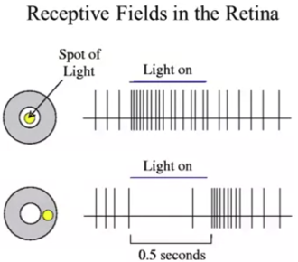
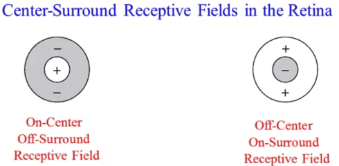
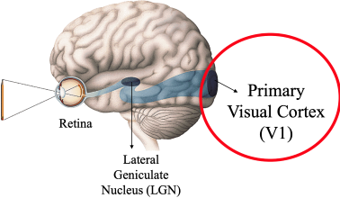
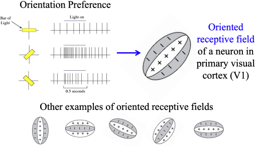

# 1.1 Models of Neuroscience
# Models of the Brain

### Descriptive Models (What)

- How do neurons respond to external stimuli and how do we describe this quantitatively with a neural encoding model (encoding)?
- How can we extract information from neurons (decoding)?

### Mechanistic Models of Brain Cells and Networks (How)

- How can we simulate the behavior of a single neuron on a computer?
- How can we simulate a network of neurons?
- Interpretive or Normative Models of the Brain (Why)
    - Why do brains operate the way they do?
    - What are the computational principles underlying their operation?

# Descriptive Models: What the model is doing

- Computational neuroscience provides tools and methods for characterizing what nervous systems do, how they function and why they operate in particular ways
- Receptive Fields
    - Specific properties of a sensory stimulus that generate a strong response from the cell
    - The receptive field of a neuron is the portion of the sensory field that affects the signaling of that neuron. For instance, the entire area that an eye can see is called the visual field, and the patch of the visual field that any single neuron monitors is that cell’s receptive field
    - The shape of a neuron’s receptive field is defined by the synaptic inputs to that neuron
    - Connections that modify the passage of information between neighboring neurons are called local, or lateral connections.
    - These lateral connections are often inhibitory, meaning that they cancel out part of the transmitted information. Inhibitory connections sculpt neural transmissions by cutting away parts of the underlying signal to sharpen aspects of the message.
- An Example: Models of “Receptive Fields”
    - Converting the electrical activity of neurons to an audio signal is a common practice in experimental neuroscience, as it allows researchers to easily and immediately tell when a neuron is active. In a typical setup, each “pop” in the signal is an action potential— when neurons fire many action potentials per second, the sound resembles loud static.

{ width=34.5% } { width=64% }

- In this example, we look at the receptive fields of neurons in the Lateral Geniculate Nucleus
- These neurons are connected to the retina and produce more activation when the light is concentrated in the center of the receptive field, and less when more light on the outside
- This Receptive Field is called on center, off surround and other other LGN cells may do the opposite
- When we talk about center-on, surround-off, or center-off, surround-on cells, remember that we’re not talking about the center and “surround” of the entire retina, but rather only the small portion of it associated with that cell
    - i.e., each cell generally cares only about what’s going on in a very small region of the visual field, and these regions tend to be on the order of a degree or two (though the size of the RF depends on its location).

{ width=49% }
{ width=50% }

- The LGN's information is passed on to the Primary Visual Cortex (V1) where the neuron's receptive fields are stimulated by oriented bars of light
- How are these oriented receptive fields obtained from center-surround receptive fields?

# Mechanistic and Interpretive Models

{ width=60% }
{ width=70% }

- Interpretive Model of Receptive Fields (oriented bars)
    - This model is still quite controversial as it doesn’t explain the other inputs which the V1 neurons receive
    - There are many recurrent connections, inputs from other V1 neurons to itself in addition to the inputs from the LGN neurons
- Interpretive Model of Receptive Fields (RFs from natural images)

{ width=75% }

- It’s worth emphasizing that the RFs on this slide are learned only from the set of natural images and do not depend at all on any experimental data. The algorithm that learns them simply chooses the ideal set of RFs for natural images subject to two constraints (1. Efficient representation (sparse coding)—representing images using as few components as possible, 2. Faithful representation— accurate representation of important image features). The fact that the RFs found by the algorithm match the RFs observed experimentally is very cool, suggesting that perhaps efficient and faithful representation were also the optimization criteria “used” during the evolution of V1