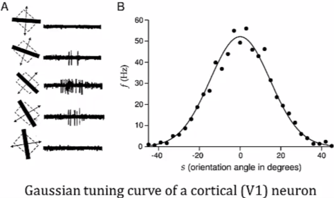

# 2.1 Neural Encoding

Created: March 17, 2021 9:35 PM
Status: Open
Updated: April 26, 2021 4:48 PM

# What is neural code?

- Information from the environment is transformed from one form to another into sensory signals which are represented in our brain
- This means we should be able to interpret these representations by analyzing neural signals, this requires discovering the form in which this information is represented in our heads

### Functional Magnetic Resonance Imaging (fMRI)

- functional magnetic resonance imaging is used as a diagnostic tool in hospitals
- This technique allows us to record from a persons brain while they're performing some task, as long as that task does not require moving around
- The person is placed inside a scanner with their head in the center of a large magnet
- The scanner measures spatial perturbations in the magnetic field, which are caused by changes in blood oxygenation
- As different parts of the brain become active, blood flows to those areas that support the underlying neural activity
- This provides a measure of activity over regions of the scale of about a cubic millimeter

### Electroencephalography (EEG)

- This method has a faster response time because it captures the changes in the electrical fields of the underlying neural circuits directly
- Some implementations are caps covered by electrodes which making contact with the scalp
- The downside of EEG is it tends to be a very noisy signal, since there are many contributions to the recorded signal
- Still, methods like fMRI and EEG are very exciting because, although they cannot record the activity of individual neurons, they're non-invasive and so they can be used on healthy, awake human subjects

### Multi Electrode Arrays

- Used to access the activity of single neurons when direct access to neural tissue is possible
- Consists of electronics and amplifiers for amplifying the tiny voltage signals extracted from individual neurons
- Each electrode is about 10 microns across, roughly the size of a single neuron
- One can record from many neurons simultaneously with the slices of brain tissue

### Calcium Imaging

- Cells contain a calcium indicator that changes its fluorescent properties when bound to calcium
- Since calcium enters the cell during action potentials, this signal acts as a record of cell firing
- Using fiber optics, deeper regions of the brain can be recorded

### Raster plots

- Although continuously varying membrane potentials can encode information, even in spiking cells, action potentials, or spikes, are canonically considered to be the “currency” of the central nervous system
- As such, the raster plot portrays only the times of these action potentials
- The raster plot is not a suitable visualization device for non-spiking cells (such as rods and cones)
- A vertical bar in the raster plot indicates a strong response, meaning that one cell fires very reliably at a particular time during the stimulus presentation, and suggesting that the cell is responding to the particular feature of the stimulus that occurs at that time
- Weaker responses are represented by thin red bars (where the cell fires during some iterations but not others)
- As such, a weak response indicates that there is something about the feature (orientation of a bar of light in the video for example) that the cell likes, but is not the feature it responds to best (the orientation is off by a few degrees from what the cell prefers, for example)

### Encoding and decoding

- Encoding: how does a stimulus cause a pattern of responses
    - Quasi mechanistic models
    - $P(Response | Stimulus)$
- Decoding: what do responses tell us about the stimulus
    - How do we reconstruct what the brain is doing, so that a person could control a prosthetic arm in the same way that they control their own arm
    - $P(Stimulus | Response)$
- The notation P(X|Y) denotes the probability of a random variable X given that random variable Y has been fixed (everything to the right of the | is assumed given)
- This is called a conditional probability distribution
- If X is independent of Y, then P(X|Y) = P(X)

### Neural Representation of Information

- The meaning of s depends on the nature of the stimulus
- While for simple stimuli such as moving bars of light, a relevant stimulus parameter can be easy to define, complex stimuli, such as faces can be very difficult to “parameterize” in a meaningful way