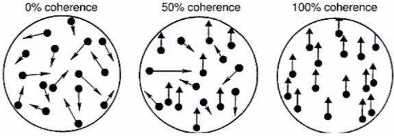

# 3.1 Neural Decoding and Signal Detection Theory

# Introductory Prompt

- Imagine you are in a forest and you hear a rustling noise which could either be a tiger or branches moving in the wind
- You then plot the amplitude of the noise you are hearing to produce:


- In this graph, the x-axis represents some stimulus parameter (such as the amplitude of the noise), and the y-axis represents probability (density)
- Noises made by the tiger are represented by the red distribution and noises made by the wind are represented by the blue distribution
- If the x-axis is amplitude, the red curve being to the right of the blue curve indicate that on average, the tiger is going to make a louder noise than the wind. However, this isn’t always the case, as is indicated by the overlap in the two curves.
- In neuroscience, the x-axis might represent the activity (firing rate) of a neuron or group of neurons, which the rest of your brain has uses in order to make a decision

# Britten et Al '92

- Britten er Al (1992) was an experiment that aimed to identify how noisy sensory information was represented by noisy sensory neurons, and how an animal's decision related to the neuronal representation
- A monkey was trained to fixate on the center of a screen, watch a pattern of random dots move, and move his eyes or "saccade" in the direction of the dots
- The monkey would get a reward whenever it make a "saccade" in the correct direction
- However, the experimenters changed the difficulty of the task by varying the number of dots that were actually moving in the chosen direction



- So let's take a look at what the neuron tells us. This data is taken from a neuron in NMT, a region in the monkey brain that's sensitive to visual motion


- For each trial, the number of spikes that the neuron produced was counted to get the firing rate
- The experimenters then made these histograms of the results, in black are the trials where the dots moved in the negative direction while the white bars are the trials where the dots moved in the positive direction
- As the experimenters decreased the coherence, the two distributions of upward versus downward choice are moved closer together
- There was less visual information that discriminated between left and right and correspondingly, the firing rates are more similar in response to those two different trials


- In the above graph, the black circles represented how the monkey reacted and the open circles are how an individual neuron reacted. The fraction that it gets right is a function of the noise level/coherence
- The data showed that there's a close correspondence between the decoded neural response and the monkeys behavior itself. Why then do we need all these neurons, especially in cortex when many of them seem to be doing approximately the same thing?
- The two are very similar thus may be connected some how and so: how does one go from that distribution of firing rates to a measure of performance?

# Decoding


- Given these distributions, we want to produce a policy that maps some value $r$, into either an upward direction or a negative direction
- This can be done by choosing a threshold, $z$, that maximizes the probability of a correct answer. Here the probability of getting an incorrect answer is  $p(r \ge z|-)$ and $p(r \le z|+)$

# Accumulated Evidence

- Assume we can observe outputs from the unknown source over a period of time, if the data we get is independent, we can now accumulate evidence in favor of one hypothesis over another


- Given a noise $r$, we can calculate the likelihoods of the sound belonging to either class and then compute their ratio: $l(s) = \frac {P(s|tiger)}{P(s|breeze)}$
- If  $l \gt 1$, then $p(tiger)$ was more likely and if  $l \lt 1$, then $p(breeze)$ was more likely. In this case, the likelihood ratio is less than 1
- As we accumulate this evidence over time, every sample is independent so we're multiplying the probabilities together. So, instead let's take the log and sum them
- Starting at $counter = 0$, and time, $t=0$, we sum the logs of the likelihood ratio

```python
def is_tiger(tiger_threshold, breeze_threshold, p_dist_tiger, p_dist_breeze):
		counter = 0
		time = 0
		is_tiger = None
		while True:
				s = getStimulus()
				likelihood = p_dist_tiger(s)/p_dist_breeze(s)
				counter += log(likelihood)
				if   counter >= tiger_threshold:
						return True
				elif counter <= breeze_threshold:
						return False
```

# Kiani, Hanks, Shadlen (2006)

- This study supports the concept of accumulated evidence in the brain
- In this task, the monkeys are fixate on a pattern of moving dots. And they indicate which direction the dots are moving in (left and right)
- Unlike the previous study, the monkeys get a reward when they answer, and a time out if they take too long; however, they can choose to respond whenever they want
- These recordings took place in the lateral interperital cortex (LIP) which contains some of the circuitry for planning and executing eye movements


- Looking at the spike rate data, the firing rate gradually increases throughout the trial
- The different color curves correspond to trials with varying coherence and the data shows that when the evidence is strong (high coherence), the firing rate increased faster (brown)
- Additionally, at the time of the saccade, all the firing rates seem to peak at a common point. This implies that the firing rates increase until they reach some threshold of confidence, at which point, the monkey is willing to make a its decision

# Scaling by Priors


- Reconsidering the solution to our initial prompt, we use the likelihood ratio to tell us what value of the sound should be interpreted as a tiger, but straight away, you probably realize that this is not the smartest way to go
- After all, the probability that there actually is a tiger is very small
- So, if we're thinking correctly, we should include in our criterion the fact that these distributions don't generally have the same weight
- They should be scaled up and down by the factors, the probability of the breeze, and soon by the probability that there was in fact, a tiger
- Currently, we only calculate $P(s|tiger)$ and $P(s|breeze)$ however, we should be calculating $P(tiger) \times P(s|tiger)$ and $P(breeze)\times P(s|breeze)$
- This means that we need to take into account the role of priors. These prior probabilities that these stimuli were in fact present.

# Evidence for Scaling by Priors

- One example where biology seems to employ the knowledge of the prior explicitly was studied in the lab of Fred Rieke
- Some rods in the retina, which collect light, are capable of responding to the arrival of single photons. Below is a current recorded from a photoreceptor


- The current has a significant amount of background noise and the photon arrival events are the large fluctuations in current shown in red
- If we produce two probability distributions, we may decide to place the threshold at the point where the two distributions intersect. However, the study found that the distribution of responses (shown in black) indicated the threshold was much farther down
- Since photon responses in any one photoreceptor are very rare, most of the time, the fluctuations are due to noise. If we take into account the prior probabilities of signal and of noise, then the two distributions now look more like:


- Now the crossing point is way over, and the response properties start to look a lot more sensible

This cover of Nate Silver's book neatly summarizes what's true for many important decisions. There's a small amount of signal in the world, as in the case of the photoreceptive current, and an awful lot of noise relative to any particular decision for the same reasons as we discussed in our last lecture. A given choice establishes a certain set of relative stimulus aspects and all other information, which may be very useful information for other purposes, becomes noise. In deciding whether to invest energy in reacting, you're not running away from the tiger, calling in the bomb squad to detonate a shopping bag, asking a girl for a date, the prior probability isn't the only factor. One also might want to take into account the cost of acting or not acting. So now let's assume there is a cost, or a penalty, for getting it wrong. You get eaten, the shopping bag explodes. And the cost for getting it wrong in the other direction, your photo gets spoiled, you miss meeting the love of your life. 

So how do we additionally take these costs into account in our decision? Let's calculate the average cost for a mistake, calling it plus when it is in fact minus. We get a loss which we'll call L minus, penalty weight, and for the opposite mistake, we get L plus. So our goal is to cut our losses and make the plus choice when the average loss for that choice is less than the other case. So we can write this as a balance of those average losses. The average or the expected loss from making the wrong decision, for choosing minus when it's plus is this expression, the weight for making the wrong decision multiplied by the probability that that occurs. And now we can make the decision to answer plus when the loss for making the plus choice is less than the loss for the minus choice. That is, when the average loss for that decision is less than the average loss in the other case. So now, let's use base rule to write these out. So now have L + P(r|-) P(r|-) divided by P(r), all that to be less than the opposite case, P(r|+)P(r) divided by the probability of response. So now you can see that when we cancel out this common factor, the probability of response, and rearrange this in terms of our likelihood ratio, because now we have here the likelihood. The probability of response given minus, on this side the likelihood for the probability of response given plus, we can now pull those factors out as the likelihood ratio and now we have a new criteria for our likelihood ratio test. Now one that takes these loss factors into account.

- Slide: Signal detection theory

o A false alarm is equivalent to choosing the answer upward when the true answer was downward; this is equivalent to the probability that the downward stimulus leads to a firing rate above the threshold z (because everything above the threshold z you label as upward, according to your rule), i.e., the probability of the firing rate being above z given that the stimulus was downward: P(r > z | downward). - Slide: Likelihood ratio

o The likelihood of a model (e.g., the stimulus being upward or downward moving) is equal to the probability of seeing the data (e.g., the firing rate) given that model. This is not the same as the probability of the model given the data, although the two are related through Bayes’ rule.

- Slide: Let’s just consider for a moment o When we say that making many observations leads to multiplying many probabilities together, we are assuming that the observations are independent across time, meaning that P(s1, s2|tiger) = P(s1|tiger)P(s2|tiger), where s1 and s2 are observations at two different times. Even if s1|tiger and s2|tiger are not independent, calculating probabilities of a long sequence of observations can lead to numerical errors in computation (for example, MATLAB may round very low probabilities to zero). Because of this, we often work with logarithms, which transform products into sums, allowing us to avoid these errors.
- Slide: Nonlinear separation of signal and noise

o In the plots of P(I|signal) and P(I|noise), the y-axis follows a logarithmic scale. This means that Gaussian probability distributions will appear as inverted parabolas. Can you think of why this is?

o Prior probabilities are very important in decision making, and they can be expressed mathematically using the chain rule of probabilities. Bayes’ rule tells us, for example, that P(tiger|sound) is proportional to P(sound|tiger)P(tiger). We don’t need to worry about the proportionality constant if we are only comparing P(breeze|sound) to P(tiger|sound), which we usually are.

- Slide: Building in cost

o In other words, the three important pieces of information you need when making a binary decision are: the evidence – the value of the sound, the prior – P(tiger), (the two combine to give the posterior P(tiger|sound)), and the cost/loss associated with a wrong/right decision.

