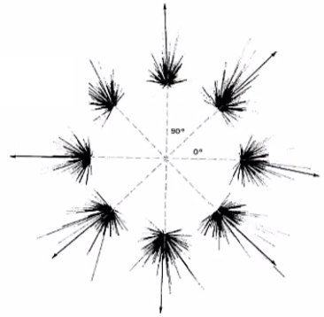

# 3.2 Population Coding and Bayesian Estimation

# Cricket Cercal System (Theunissen & Miller '91)

- Crickets are able to sense the motions of air using hair-covered antennae called the cercai on the back of their abdomen
- These small hairs contain neurons at their base that sense the mechanical forces caused by wind motion and convert their velocities into electrical signals

- Some experimentation found that there were only 4 types of neurons, which had peak responses in one of four cardinal directions. This is shown in the above graph where the response (normalized by its max) is plotted against the direction of the stimulus

- As seen above, the response curves are approximately shaped like cosines
- Therefore, these neurons' firing rates, $f$, are proportional to the cosine of the angle between their preferred direction and the direction of the wind, $s$
- The cosine allows us to interpret the neurons' firing rate as proportional to the projection of the wind velocity, $\overrightarrow v$, onto the cardinal vectors, $\overrightarrow c_a$

$$
\bigg(\frac{f(s)}{r_{max}}\bigg)_a = [cos(s-s_a)]_+
$$

$$
\text{let: }\\ \cos (s) = \frac {r}{|v|}
$$

$$
\because |v| = 1 \implies \cos (s) = r
$$

$$
\therefore \\\bigg(\frac{f(s)}{r_{max}}\bigg)_a = [\overrightarrow v \cdot \overrightarrow c_a ]_+
$$

- Now we can take the responses of all the neurons and compute something called the Population Vector:

$$
\overrightarrow v_{pop}= \sum_{a=1}^4 \bigg(\frac{r}{r_{max}}\bigg)_a \overrightarrow c_a
$$

- Each neuron adds in a component in its preferred direction, with a weight given by its firing rate, which approximates the projection of the wind direction onto that preferred direction
- Now comparing the estimate that we get from this population vector, you can see that there's a small although systematic error in that estimate of the entire 360 degree range of wind directions
- Theoretically, the crickets' neurons should only need two basis vectors to represent velocity in two dimensions; however, the crickets' neurons instead use four directions, because:
    - Neurons cannot have a negative firing rate; thus cannot encode negative information
    - Sensory neurons can only respond to motion along its primary motion-sensitive axis but not against it; they can only decode scalar information
- As a result, we need pairs of vectors that face in opposite directions so that motion in either direction can be encoded

# Population Coding in M1

- One study which aimed to decode information from the motor cortex found that this same mechanism of cosines and population coding is utilized
- In this study, a brain computer interface recorded the firing rates of the motor neurons of a subject while they moved their arms. The direction of the arms movement was also recorded
- Like the cricket cercal cells, each motor neuron's response had the form of a cosine around some baseline firing rate, $r_0$. In the above example, $r_0 \approx 30Hz$

- In this figure, the responses from each different type of neuron was organized by their preferred direction. Each of which had a set of vectors representing the responses from various trials
- Each vector represents a neurons response where its magnitude represented the firing rate of the trial and its direction represented the direction of the arm movement
- So once again, we're going to interpret the firing rate as the cosine of the angle between the arm movement and the neuron's preferred direction.

$$
\bigg(\frac{\langle r \rangle -r_0}{r_{max}}\bigg)_a =\bigg(\frac{f(s) -r_0}{r_{max}}\bigg)_a = \overrightarrow v \cdot \overrightarrow c_a
$$

- And once again, we can compute a population vector by weighting each neuron's preferred direction, $\overrightarrow c_a$, individual for every neuron, by its firing rate.

$$
\overrightarrow v_{pop}= \sum_{a=1}^N \bigg(\frac{r-r_0}{r_{max}}\bigg) \overrightarrow c_a
$$

$$
\langle \overrightarrow v_{pop} \rangle = \sum_{a=1}^N \big( \overrightarrow v \cdot \overrightarrow c_a \big) \overrightarrow c_a
$$

- So if we have enough neurons in our population, this population vector average is going to converge and be parallel to the direction of arm movement.
- Some neurons have an intrinsically higher firing rate and we want each neuron to contribute to the population vector in a way that is proportional to its relative activation

# Issues with Projections in Pop. Coding

- While this technique is quite useful, it is rather specific to this kind of response and raises some questions:
    - What do we do with tuning curves that are not cosines? So they're not well interpreted as the projection onto a population vector.
    - What if some neurons are better tuned than others?
    - What about noise, some neurons are more noisy than others. I would like to be able to weight the contributions from those different neurons.
    

# Bayes

So given the limitations of the population vector approach, we tried to try something a little bit more general. You've seen Bayes' law a few times now, and you'll be getting the correct sense that it's a very useful concept. So here we're going to use it for some definitions, so to remind you, here's the basic breakdown. The probability of stimulus given response, of course, can be written in this alternate form.

So now we've seen this conditional distribution probability of response given stimulus, very often. And we've called that the likelihood function, and worked with that in the last few examples. P of s is the prior distribution, as we've also discussed. Probability of r is called the marginal distribution, and that's really just a normalization constant. So the probability or response, we can write as an integral over all the stimuli, probability of response given the stimuli times the probability of the stimulus. So here on the top, you see an example of that term that's in the integral for one particular stimulus. Now we're just going to average that over all the stimuli, and so that gives us this normalization on the bottom. And finally we have the a posteriori distribution, so the distribution that you get once you incorporate all these factors of the conditional distribution and the prior.

- So the two distributions that we're focused on have first the likelihood, that's the one we've already walked with in signal detection theory, and second is the a posteriori distribution.
- Now we can define two important and general decoding strategies which utilize these two distributions
- The first is maximum likelihood up here, which we first mentioned in the context of fitting coding models, and again in the decoding of two alternatives, and then we're going to use it in a slightly more general way. In maximum likelihood, one searches for the special stimulus value, s*, that maximizes the likelihood in our true alternative choice.
- That's how we mapped any value of the response onto a stimulus, or chose the stimulus value that had the larger likelihood. Alternatively, we can look for a stimulus that maximizes the a posteriori distribution. That's called maximum a posteriori, or MAP.

- Assuming a neuron's response $r$, occurs given a stimulus $s$, scaled by a constant $a$, with Gaussian white noise $n$ we can define the MLE and MAP as such

$$
r=as+n
$$

$$
\hat s_{MLE}(r) = argmax_s p(r|s) 
$$

$$
p(r|s) = \frac {1}{\sqrt{2\pi}\sigma} \exp \bigg(\frac {(r-as)^2}{2\sigma}\bigg)
$$

$$
\text{measure: } y = \bar y = a \hat s_{MLE}
$$

$$
\hat s_{MAP}(r) = argmax_s p(s|r)
$$

$$
= argmax_s \frac{p(r|s)\times p(s)}{p(y)}
$$

$$
= argmax_s \frac{p(r|s)\times p(s)}{\int_s p(r|s) p(s)ds}
$$

In general, these are going to differ because of the role of the prior, that's what makes the two sides differ.

That means that, in maximizing the a posteriori distribution, we're biasing our choice for what we know about the stimulus in advance. We'll see an example of this later.

So the plan for today is to work through a classic example of the applications of these techniques to a somewhat idealized, yet reasonable, version of a population code. Let's imagine that we have a population of neurons that encode Some particular stimulus parameter, s, taps the orientation of an edge. Let's also take our inspiration from B1 responses and assume that the form of the response function is Gaussian. So let's say neuron one has a response that looks like this. So as a function of s, it has some preferred orientation. So let's call this neuron one, so that has a preferred response at stimulus 1. And some firing curve f1(s).

And now imagine that we have many other neurons that have centers, preferred orientations that are along this line, and they all have their own, Gaussian response functions.

So we're going to make two particular assumptions. One is that each neuron fires independently. That is, even though they're driven by a common input, and some that have overlapping receptive fields will then necessarily fire at similar times. There's variability in their responses that's independent and private to each neuron.

We'll also need an explicit model for that variability. And that's going to give us an opportunity to make good use of what we learned last week about the Poisson distribution.

So here this is drawn more nicely, here's our stimulus axis. So as a function of stimulus, here's the response curve fa(S) for neuron a. And then as one scrolls along different neurons indexed by a, you see that that's going to span the whole possible range of s. And that we're going to define these tuning curves to be Gaussian.

We're also going to assume that these receptive fields span the range of s uniformly. That is to say, no matter what value of s we take, there's always a plenty of neurons that are encoding that region of stimulus space. And so what that's going to correspond to is that, if we choose some value of s, and we look at the responses of our population of neurons. There is a number of neurons that are going to be responding to that value. In this case, here, here, here, here and here. If we add up the responses of all of those neurons to that stimulus, we're going to get some overall firing rate. And that firing rate is constant, independent of s, so we're going to express that as the sum of all the neurons in the population. Take their average firing rate as a function of s and that doesn't depend on s, so that we get the same average firing rate, no matter what our stimulus value is. So here's the response of 11 such neurons. Each of which has a different preferred orientation, this is being driven by some stimulus. The firing rate of each neuron is plotted against that neuron's preferred orientation.

The neuron in the middle responds maximally when driven with a value of the stimulus s = sa = 0. While the neuron with a preferred orientation say of -5 Is not driven at all. Now you see that for this simulated data, there is like a real data, a lot of variability. If we did many trials of the presentation of this stimulus, and we plotted the same data, the average of all of the responses would lie along this dotted line. But there would be a standard deviation around the average,

some error bars on this, is given by, do you remember? So what would it be for a Poisson firing neuron?

So here's the expression for the probability of seeing case spikes in a chunk of time of lengths T. Let's do a quick review of what we learned last time about about Poisson firing. Spikes are produced randomly and independently in each time bin with a probability given by the instantaneous rate. And so what that implies is that if we have some length of time T,

we walk through at least the steps of how one comes about calculating the probability of k spikes occurring in that length of time, T.

Now let's see how we apply this expression in a particular case that we've set up.

So let's start by figuring out each individual neuron's response. Let's say that neuron a has response ra to a given stimulus, to stimulus s.

So we'd like to write down the probability of that response for this particular neuron, for neuron labelled by a, to that input stimulus. So what is that probability? Now we're going to use this Poisson model. Let's see how we substitute the terms in this Poisson model for terms that we've developed in our example. So now we want the probability given time T of k spikes. So k spikes, because we have a firing rate, ra, for our given neuron. So the probability of ra is going to be equal to,

now, this parameter r is the mean firing rate. So what's the mean firing rate of our neuron?

That's given by its response curve, that was called that fa(s). And now, in this case, we're giving the neuron stimulus s, and so now our mean response is going to be given by that tuning curve value, (fa(s)T). Now k again is the number of spikes, ra that we actually observed, times T. Now exponential minus, and now again we need this parameter r. That's our tuning curve value, gives us the average response T divided by ra.

Now how do we write down the full distribution for all of the neurons at the same time? So we're going to represent by vector r. The vector of responses of all the different neurons rn.

So what is the probability of all of those responses? Because we've said they're independent, that's just going to be the product of all the individual probabilities. P(ra), a = 1 to n ,all right? So when we condition that on the stimulus, that's the probability of r given a stimulus will be the product again over all the neurons.

So now if we write in the explicit expressions for the individual neurons, we get a complete expression for our population response that's of this form.

So now that we have our expression for the total stochastic response, let's calculate the maximum likelihood solution. To do that, it's useful as we've done before, to work with the log likelihood rather than the likelihood directly. Especially when we look at the form of this equation, so let's take the log. So log P(r given s) is going to be equal to. So now, taking the log of that product is going to give us a sum over. Now the ra T comes down from the exponent, becomes the log of fa(s)T. Now this is going to come out from under the exponential fa(s) of T- log (ra of T)!

Sum of that overall neurons. So now we need to find the s, value of s for which that's maximized. So how does one do that in general? If one has some function like this, f as a function of s, and we're looking for, the S prime which is at for which F takes its maximum value then what we do is take the derivative of F with respect to S and set that equal to 0 and then solve this equation for S. So now our goal is to calculate the derivative of this equation, before we do that we should notice that there are a couple of terms here that are not going to survive, so this guy doesn't depend on s. So the derivative with respect to s is going to go away. We should also notice this term. So what do we have here? We have a sum over fa s times t over all the neurons. A = 1 to N. Now if you recall we required that this be a constant. This was a condition that we made on our tuning curves that we had good coverage of the parameter s across the entire range. So that the total firing rate, total average firing rate which is given by this term doesn't depend on s. And so now when we take the derivative with respect to s that term's going to go away. So what do we have left? We now have T times sum over a = 1 to N ra, now the log of some function of s take its derivative with respect to s, we're going to get the derivative of that function.

F prime times T over the function itself.

So now we're going to get T sum over a ra f prime of s over f(s). And now we will set that to 0 and solve that for the value of s that solves that equation. So now, here's the expression that we'd like to solve for s*. So how do we do that? So f as a function of s is equal to some pre factor Ae to the minus 1 over 2 sigma squared,

s minus sa that's central value. And now f prime of s equaling a. And now we bring down this factoring. There's a square, that that cancels with the half. There's a minus sign, then that cancels with this minus sign, so we get s minus s a over sigma squared. Multiplying the same thing we had before, 1 over 2 sigma squared (s- sa) squared. And so now this equation is quite simple, so we have a = 1 to N RA. What do we have left?

F prime and the F are going to cancel out these exponential factors and the A, and so all we're left with is S minus SA.

Over sigma squared equals 0. So now one can solve that for s = s* and we're going to find the following solution. So s star is equal to ra times sa divided by sigma a squared and that's divided by the total sum of the firing rates where each is again normalized by its variance.

Play video starting at :19:47 and follow transcript19:47

Now if all the sigmas are the same, these factors cancel above and below and we get back an expression which should look very familiar.

It's very similar to the population vector. So what do we gain by all this procedure? Well we made a lot of assumptions to make that work out so nicely. And the Gaussian distribution is one in which that came out so cleanly. If we go back, this one step, we see something that we would have hoped for. But each neuron's contribution is weighted by the inverse of its variance. That is if a neuron has a sharply peaked tuning curve, if it's very informative about the stimulus parameter, its variance will be small. And its contribution will be large. So this method takes care of weighting the various neuronal opinions according to their reliability and their informativeness.

So now, let's calculate the maximum a posteriori solution. So now we have to maximize, not the log of the likelihood, but the log of this a posteriori distribution with respect to s. So we can write that down. We can use Baye's law to just write that in terms of the likelihood, and in terms of the prior, and also in terms of the marginal distribution.

And now let's just consider those terms that will depend on s. So as before, we can throw away or leave out for now any terms that don't depend on S that only depend on R, so that gets rid of this term so now here's our log of the likelihood that we wrote down before and the log of the prior and we've also gotten rid of that term that was a sum over the firing rates, because we're again assuming that to be constant and won't depend on the stimulus, so it will disappear in the derivative. So now, taking the derivative and setting it to 0, throwing away the sum equals constant, we get a new expression that we now need to solve for S prime. And you see that all we've done is add to that this expression that depends on the prior probability.

Using again the Gaussianity of the tuning curves we can write down that solution. I'll leave it as an exercise for you. And so what you find is that we have these original terms that we got from the likelihood, but now they're shifted. We now get a solution for s, for s star that's shifted by the prior. So what prior have we assumed here? We've taken an Gaussian prior, where the mean is s prior, and it has some standard deviation, sigma prime. And now the effect of such a prior is to add on this additional term that's going to bias our estimate of s star. And now you can see that as one changes the standard deviation, the width of this prior. So let's take the case that sigma squared is very small so that we have a prior that's very peaked. Around s prior. So that means that this term, this additional term is going to get very large, and now s prior is going to have a strong effect in biasing s star. Whereas if the prior is very broad, Equivalent to saying we don't have very strong information about exactly what value s takes on in general. Then, this term is going to be weak and in the limit of a constant prior. Where sigma squared goes to infinity this term will disappear altogether, and we'll get back to the maximum likelihood solution.

So what are the limitations of these approaches? One is that it stays within the confines of the description in terms of tuning curve and mean firing rate. So it doesn't really incorporate rapid time variations. It also doesn't take into account correlations in the population. What was very important to have being able to write down a full distribution of responses given the stimulus is that we're able to assume that neurons respond independently.

The question of correlations in the neural code is as we've just seen really fundamental to how we go about deciphering the firing rates, the firing responses of many neurons. This is a major part of the agenda of neuroscience for the next decade including with methods such as I'm showing here with calcium imaging. Or we can record from many neurons simultaneously. So it's not surprising that understanding correlations, both experimentally and theoretically, is a major current area of investigation. My friend and University of Washington colleague, Eric Shay Brown, will be joining us as a guest lecturer in the course to talk about this issue in more depth. So we're going to stop here for this session and come back to finish this lecture with a discussion of, of reconstruction. How one recreates estimates of time varying complex stimuli from neural activity.