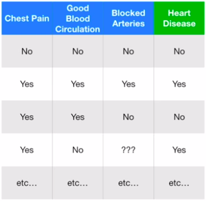

# Classification and Regression Trees
## Classification Trees
### Creating our tree
- Trees are composed of a root node, branches, and leaf nodes
- We generate our tree from a tabular dataset which contains input columns (blue) and output columns (green)

### Determining our root node
- To determine the root node, we want to find the best decision that we can use to separate our data
- If we can seperate our output classes perfectly, using a single variable, that decision is **pure**
- Unfortunately this is usually not the case, thus to compare which decision is best, we calculate the **impurity** of each column to find the best decision for our root node
- One metric to quantify the impurity of a decision is the **Gini Index**
$$\text{Gini impurity (GI)} = 1 — P(\text{Yes})^2 — P(\text{No})^2$$

### Binary/One-Hot Encoded data
- This is very simple since we don't have to do anything to seperate the data into two groups
- ex Calculating GI for the chest pain variable:

- GI for the left leaf $= 1-(105/(105+39))^2-(39/(105+39)^2 = 0.395$
- GI on the right leaf $= 1-(34/(34+125))^2-(125/(34+125)^2 = 0.336$

- We have measured the Gini impurity for both leaf nodes, we can **calculate the total GI using Chest Pain to separate patients with and without Heart Disease.**
- Since both sides have a different number of samples, we must weigh them as more samples should be more significant
    - The left leaf node represents 144 patients. The right leaf node represents 159 patients.
    - So, take the **weighted average** of the leaf node impurities.

    - GI for Chest Pain $= 144/(144+159) * 0.395 + 159/(144+159)*0.336 = 0.364$
- We repeat this for all of the variables and then take that with the lowerst impurity, this is our root node
- We then repeat this for each subset of our dataset within our child nodes
- We stop when the GI score does not improve when seperating the child nodes

### Numeric data

1.  Sort the patients by weights, from lowest to highest
2.  Calculate the average weight for all adjacent patients
3.  Calculate the impurity values for each average weight

205 has the lowest GI. So this is the cutoff and impurity value we use to compare the weight to chest pain/blocked arteries.

### Ranked data

Ranked data is similar to numeric data, except instead now we calculate impurity scores for all possible ranks.

Note: No need to calculate an impurity score for Blue or Red or Green since that includes everyone.

## Regression Trees
